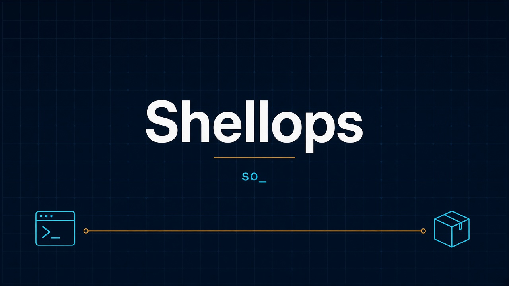

<p align="center">
  
</p>

## Install

### macOS / Linux

```bash
curl -fsSL https://sherin.dev/shellops/install.sh | bash
```

Same script from GitHub, if sherin.dev is unavailable:

```bash
curl -fsSL https://raw.githubusercontent.com/SherinBloemendaal/shellops-cli/main/install.sh | bash
```

Pin a release with `bash -s`:

```bash
curl -fsSL https://sherin.dev/shellops/install.sh | bash -s v1.0.0
```

The script installs `so` to `~/.shellops/bin` (override with `SHELLOPS_INSTALL`). It adds that directory to your shell config when the directory is not already on `PATH`. Run it again to upgrade in place.

`SHELLOPS_VERSION` pins a tag the same way as the first argument.

Published archives, checked against `SHA256SUMS` on the GitHub release:

| Platform            | Asset                                  |
| ------------------- | -------------------------------------- |
| macOS Apple Silicon | `so-aarch64-apple-darwin.tar.gz`       |
| macOS Intel         | `so-x86_64-apple-darwin.tar.gz`        |
| Linux x86_64 (musl) | `so-x86_64-unknown-linux-musl.tar.gz`  |
| Linux arm64 (musl)  | `so-aarch64-unknown-linux-musl.tar.gz` |

<p align="center">
  <a href="https://github.com/SherinBloemendaal/shellops-cli/actions/workflows/ci.yml"></a>
  <a href="LICENSE"></a>
  
  
</p>

## Shellops

**Shellops** (`so`) runs Docker Compose, PHP tooling, and releases for a project whose git root contains `compose.yml`. Repo: [github.com/SherinBloemendaal/shellops-cli](https://github.com/SherinBloemendaal/shellops-cli).

The project root is that git root. `so` loads `.env` from it. `APP_ENV=dev` selects the dev environment; every other value, including an unset `APP_ENV`, is prod. There is no `.shell-ops.env`.

## Commands

`so` with no command prints colored help.

| Command                            | What it does                                                                |
| ---------------------------------- | --------------------------------------------------------------------------- |
| `so compose ...`                   | Run `docker compose`. Sets `UID`, `GID`, and `USER` when they are unset.    |
| `so build`                         | Build each `*.Dockerfile`, dependencies first, and tag it `latest`.         |
| `so cc`                            | Clear caches in three phases, with three attempts each.                     |
| `so console`, `so c`               | `bin/console` in the php service.                                           |
| `so composer`, `so cp`             | Composer. `install` keeps `--optimize-autoloader --classmap-authoritative`. |
| `so dump`                          | `composer dump-autoload`.                                                   |
| `so csf`, `so csfixer`             | PHP CS Fixer.                                                               |
| `so phpstan`                       | PHPStan.                                                                    |
| `so phan`                          | Phan. PHP paths become an include-analysis file list.                       |
| `so phpunit`                       | PHPUnit.                                                                    |
| `so rector`                        | Rector.                                                                     |
| `so phpmd`                         | PHPMD.                                                                      |
| `so fixtures`, `so f`              | Load Doctrine fixtures.                                                     |
| `so reset-database`, `so rd`       | Drop the database, migrate, and load fixtures.                              |
| `so force-drop-database`, `so fdd` | `dropdb -f` against `POSTGRES_DB`.                                          |
| `so installer`                     | Composer install, bring the stack up, clear caches, and reset the database. |
| `so yarn`                          | Yarn inside the vue service.                                                |
| `so debug`                         | Show the detected root, env, identity, and build order.                     |
| `so sort-dotenv FILE`              | Sort a dotenv file in place.                                                |
| `so keypair DIR [SUFFIX]`          | Write an OpenSSL private/public key pair.                                   |
| `so randomstr LENGTH`              | Print a random alphanumeric string.                                         |
| `so config`                        | Get, set, list, and unset settings.                                         |
| `so release`                       | Bump a version, commit, and push one annotated release tag.                 |
| `so update`                        | Download and install the latest `so` release.                               |
| `so github`                        | Open the GitHub repository in the browser.                                  |

`so compose` passes every argument through and returns the compose exit code. In dev, when stdin is a terminal and a local image is missing, it asks whether to build.

`so build` reads `*.Dockerfile` in the project root. An image that references `/bundler:` is built after bundler. The image prefix comes from `image:` lines in the compose files. Build args are only the `ARG` names declared in that Dockerfile, filled from the environment, `.env`, and computed `UID`, `GID`, `USER`, and `VERSION`. `--secret` is added only when `.docker-secrets.env` exists. The local tag is `latest`.

`so cc` runs three phases with a progress spinner: filesystem and Symfony caches, Redis when `docker compose config --services` lists `redis`, and a PHP reload plus `messenger:stop-worker` when `messenger_workers` is listed. Each phase retries three times.

`so update` checks `SHA256SUMS`, then replaces the binary in `$SHELLOPS_INSTALL` or `~/.shellops/bin`. A daily check is cached at `~/.shellops/update-check.json`. Set `SHELLOPS_NO_UPDATE_CHECK=1`, or run with stdout that is not a terminal, and the check stays quiet.

`so github` opens https://github.com/SherinBloemendaal/shellops-cli.

## Config and secrets

Settings live in `~/.shellops/config.toml`. Secrets live in `~/.shellops/secrets.toml` with mode `0600`. This keeps a secret out of the shell history when you pass it on stdin. It is not encryption.

```bash
so config set openrouter --secret --stdin
so config set openrouter.model openai/gpt-4o-mini
so config set github --secret --stdin
so config set example value --project
so config get example
so config list
so config unset example
```

`--project` stores the key under `[project."<git-root>"]`. Lookup order is project, then global, then an inferred default (`openrouter.model` defaults to `openai/gpt-4o-mini`). `so config get` refuses a secret. `so config list` prints `********` for secrets.

## Release flow

`so release` cuts a release from the default branch of the current repository. It fetches tags, requires `HEAD` to match `origin/<branch>`, and warns when the tree is dirty.

A `package.json` with `workspaces` opens a package menu. Otherwise the package is the GitHub repository name and the version is the root `VERSION` file. Verbleif Auth is that single package: `auth`.

Choose a bump (`patch`, `minor`, `major`, `current`) and a channel (`stable`, `rc`, `beta`, `alpha`). The prerelease number comes from existing marker tags `<package>-v<version>-<channel>.N`. The annotated tag is `release-v<date>.<seq>[-<channel>.N]`. Its message contains `packages:` and `channel:`. The commit subject looks like `chore(release): auth 1.0.34`. The branch and tag are pushed with `git push --atomic`. If the push fails, the local commit and tag are removed.

After the tag, `so` asks whether to create a GitHub Release. Notes are drafted from `git log --no-merges`, `git diff --stat`, a size-capped filtered diff, and separate signals for `migrations/` and `.env.example`. The draft comes from OpenRouter (`https://openrouter.ai/api/v1/chat/completions`) using the `openrouter` secret and the `openrouter.model` setting. You can publish, edit in `$EDITOR`, regenerate, or cancel. The GitHub token is the `github` secret, or `gh auth token` when that secret is unset. `rc`, `beta`, and `alpha` are prereleases. Only `stable` is marked latest.

## Build from source

Requires Rust 1.88+.

```bash
git clone https://github.com/SherinBloemendaal/shellops-cli
cd shellops-cli
cargo install --path .
```

## License

[MIT](LICENSE)
