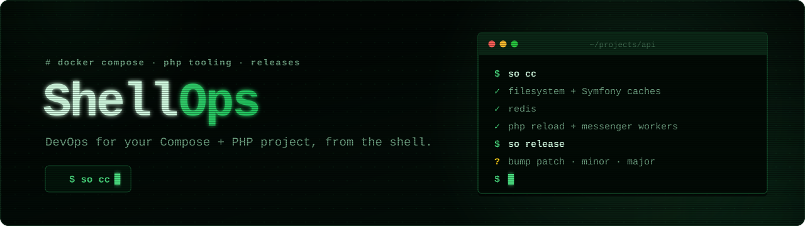
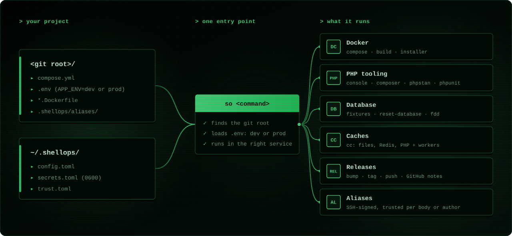

<div align="center">

<picture>
  <source media="(prefers-color-scheme: dark)" srcset="assets/banner-dark.svg">
  
</picture>

<br>

<a href="https://github.com/SherinBloemendaal/shellops-cli/actions/workflows/ci.yml"></a>
<a href="https://github.com/SherinBloemendaal/shellops-cli/releases/latest"></a>
<a href="LICENSE"></a>


**ShellOps** (`so`) runs Docker Compose, PHP tooling, and releases for a project whose git root contains `compose.yml`.<br>
Repo: [github.com/SherinBloemendaal/shellops-cli](https://github.com/SherinBloemendaal/shellops-cli)

[Install](#-install) · [How it works](#-how-it-works) · [Commands](#-commands) · [Config](#-config-and-secrets) · [Setup](#-setup) · [Aliases](#-aliases) · [Releases](#-release-flow)

</div>

<br>

## ✨ Highlights

- **Knows your project.** Finds the git root, loads `.env`, and picks dev or prod from `APP_ENV`.
- **One short command per chore.** Compose, image builds, PHP tooling, database resets, and caches.
- **Guarded releases.** `so release` requires `HEAD` to match `origin`, pushes branch and tag atomically, and drafts GitHub release notes.
- **Signed aliases.** Shared shortcuts are signed with your SSH key and only run for others once they trust them.
- **Verified updates.** `so update` checks `SHA256SUMS` before it replaces the binary.

## 📦 Install

```bash
curl -fsSL https://sherin.dev/shellops/install.sh | bash
```

> Works on **macOS** and **Linux**. Pin a release with `bash -s`:
>
> ```bash
> curl -fsSL https://sherin.dev/shellops/install.sh | bash -s v1.0.0
> ```

The script installs `so` to `~/.shellops/bin` (override with `SHELLOPS_INSTALL`). It adds that directory to your shell config when the directory is not already on `PATH`, and links `so` into the first writable directory that already is (`~/.local/bin`, `~/bin`, `/opt/homebrew/bin`, or `/usr/local/bin`), so `so` works at once in every open terminal. Without such a directory it prints the one `source` command that loads it. Run it again to upgrade in place.

`SHELLOPS_VERSION` pins a tag the same way as the first argument.

<details>
<summary><b>Published archives</b></summary>

<br>

Checked against `SHA256SUMS` on the GitHub release:

| Platform            | Asset                                  |
| ------------------- | -------------------------------------- |
| macOS Apple Silicon | `so-aarch64-apple-darwin.tar.gz`       |
| macOS Intel         | `so-x86_64-apple-darwin.tar.gz`        |
| Linux x86_64 (musl) | `so-x86_64-unknown-linux-musl.tar.gz`  |
| Linux arm64 (musl)  | `so-aarch64-unknown-linux-musl.tar.gz` |

</details>

## 🧭 How it works

<picture>
  <source media="(prefers-color-scheme: dark)" srcset="assets/how-it-works-dark.svg">
  
</picture>

The project root is that git root. `so` loads `.env` from it. `APP_ENV=dev` selects the dev environment; every other value, including an unset `APP_ENV`, is prod. There is no `.shell-ops.env`.

## 🧰 Commands

`so` with no command prints colored help.

| Command                            | What it does                                                                |
| ---------------------------------- | --------------------------------------------------------------------------- |
| `so compose ...`                   | Run `docker compose`. Sets `UID`, `GID`, and `USER` when they are unset.    |
| `so build`                         | Build each `*.Dockerfile`, dependencies first, and tag it `latest`.         |
| `so cc`                            | Clear caches in three phases, with three attempts each.                     |
| `so console`, `so c`               | `bin/console` in the php service.                                           |
| `so composer`, `so cp`             | Composer. `install` keeps `--optimize-autoloader --classmap-authoritative`. |
| `so dump`                          | `composer dump-autoload`.                                                   |
| `so csf`, `so csfixer`             | PHP CS Fixer.                                                               |
| `so phpstan`                       | PHPStan.                                                                    |
| `so phan`                          | Phan. PHP paths become an include-analysis file list.                       |
| `so phpunit`                       | PHPUnit.                                                                    |
| `so rector`                        | Rector.                                                                     |
| `so phpmd`                         | PHPMD.                                                                      |
| `so fixtures`, `so f`              | Load Doctrine fixtures.                                                     |
| `so reset-database`, `so rd`       | Drop the database, migrate, and load fixtures.                              |
| `so force-drop-database`, `so fdd` | `dropdb -f` against `POSTGRES_DB`.                                          |
| `so installer`                     | Composer install, bring the stack up, clear caches, and reset the database. |
| `so yarn`                          | Yarn inside the vue service.                                                |
| `so debug`                         | Show the detected root, env, identity, and build order.                     |
| `so sort-dotenv FILE`              | Sort a dotenv file in place.                                                |
| `so keypair DIR [SUFFIX]`          | Write an OpenSSL private/public key pair.                                   |
| `so randomstr LENGTH`              | Print a random alphanumeric string.                                         |
| `so config`                        | Get, set, list, and unset settings.                                         |
| `so init`                          | Set up a signing identity, OpenRouter, GitHub, and a Docker check.          |
| `so alias`                         | Create, edit, trust, and run signed shell aliases.                          |
| `so release`                       | Bump a version, commit, and push one annotated release tag.                 |
| `so update`                        | Download and install the latest `so` release.                               |
| `so github`                        | Open the GitHub repository in the browser.                                  |

<details>
<summary><b>How <code>compose</code>, <code>build</code>, <code>cc</code>, <code>update</code>, and <code>github</code> behave</b></summary>

<br>

`so compose` passes every argument through and returns the compose exit code. In dev, when stdin is a terminal and a local image is missing, it asks whether to build.

`so build` reads `*.Dockerfile` in the project root. An image that references `/bundler:` is built after bundler. The image prefix comes from `image:` lines in the compose files. Build args are only the `ARG` names declared in that Dockerfile, filled from the environment, `.env`, and computed `UID`, `GID`, `USER`, and `VERSION`. `--secret` is added only when `.docker-secrets.env` exists. The local tag is `latest`.

`so cc` runs three phases with a progress spinner: filesystem and Symfony caches, Redis when `docker compose config --services` lists `redis`, and a PHP reload plus `messenger:stop-worker` when `messenger_workers` is listed. Each phase retries three times.

`so update` checks `SHA256SUMS`, then replaces the binary in `$SHELLOPS_INSTALL` or `~/.shellops/bin`. A daily check is cached at `~/.shellops/update-check.json`. Set `SHELLOPS_NO_UPDATE_CHECK=1`, or run with stdout that is not a terminal, and the check stays quiet.

`so github` opens https://github.com/SherinBloemendaal/shellops-cli.

</details>

## 🔧 Config and secrets

Settings live in `~/.shellops/config.toml`. Secrets live in `~/.shellops/secrets.toml` with mode `0600`.

> [!CAUTION]
> `--stdin` keeps a secret out of the shell history, and the file is mode `0600`. It is not encryption.

```bash
so config set openrouter --secret --stdin
so config set openrouter.model openai/gpt-4o-mini
so config set github --secret --stdin
so config set example value --project
so config get example
so config list
so config unset example
```

`--project` stores the key under `[project."<git-root>"]`. Lookup order is project, then global, then an inferred default (`openrouter.model` defaults to `openai/gpt-4o-mini`). `so config get` refuses a secret. `so config list` prints `********` for secrets.

## 🪄 Setup

`so init` walks four steps. For each step choose **Set up now**, **Later**, or **Skip**. Finished steps are skipped until you run that step again.

| Step         | What it stores                                                                  |
| ------------ | ------------------------------------------------------------------------------- |
| `identity`   | GitHub login and the SSH public key that signs aliases.                         |
| `openrouter` | API key (secret) and model, after a key check, model pick, and a 5-token probe. |
| `github`     | `gh auth token`, or a pasted token saved as the `github` secret.                |
| `docker`     | Nothing. It checks `docker info` and `docker compose version`.                  |

```bash
so init
so init openrouter
so init status
so init status --check
```

Status is `[setup]` in `~/.shellops/config.toml` (`done`, `later`, or `skipped`). A step left on `later` prints one reminder per day. Set `SHELLOPS_NO_SETUP_HINT=1` to hide it. Without a terminal, `so init` refuses and points at `so config set`.

`so init identity` asks for a GitHub login (suggested from `gh` when that is logged in) and an SSH public key from `ssh-add -L` or `~/.ssh/*.pub`. The key must be listed at `https://github.com/<login>.keys`. The private key stays in ssh-agent. Signing uses `ssh-keygen -Y sign`.

> [!NOTE]
> The OpenRouter probe costs a fraction of a cent, and the wizard says so before it sends the request. A failed check saves nothing.

## 🔐 Aliases

An alias is a shell script `so` runs as `sh -c`. Extra arguments become `$1`, `$2`, and so on. The script is not concatenated into the command string.

```bash
so alias create --dir fixall 'so csf && so phpstan'
so alias create --global note --stdin
so fixall
so alias list
so alias view fixall
so alias edit --dir fixall
so alias rename --dir fixall lint
so alias rm --dir lint
```

`--dir` writes `<git-root>/.shellops/aliases/<name>.toml`, found from any subdirectory of that repo. Outside a git repo it uses the current directory. Commit that file. `--global` writes `~/.shellops/aliases/<name>.toml`.

`so alias create` needs `so init identity`. It signs the body with your SSH key. You can run your own alias immediately. Someone else who pulls the file cannot, until they trust it:

```bash
so alias trust fixall
so alias trust fixall --author
so alias untrust fixall
so alias untrust fixall --author
```

`so alias trust` trusts that exact body (SHA-256). `--author` trusts the signing key, so later aliases from that person run too. Trust records the key fingerprint, not the GitHub name alone. Trust lives in `~/.shellops/trust.toml` (mode `0600`) and is not committed.

> [!IMPORTANT]
> A changed body with the old signature never runs, including after a hand edit. `so alias edit` opens `$EDITOR` (or reads `--stdin`), shows the diff, and signs again. You become the author.

<details>
<summary><b>Scopes, name rules, and nesting</b></summary>

<br>

Pass exactly one of `--global` or `--dir` to `create`, `edit`, `rename`, and `rm`. `view` and `trust` ask for the flag only when both scopes have the name. Creating a directory alias is refused when a global one already has that name. Creating a global alias is allowed when a directory one exists, but running the name then refuses both and tells you to `so alias rename --global <name> <new>` or remove the directory alias. Names match `[a-z][a-z0-9-]*` and cannot shadow a built-in command. Nested aliases stop at `SHELLOPS_ALIAS_DEPTH` 8.

</details>

`so` and `so help` list the aliases in the current repo and the global store.

## 🚀 Release flow

`so release` cuts a release from the default branch of the current repository. It fetches tags, requires `HEAD` to match `origin/<branch>`, and warns when the tree is dirty.

A `package.json` with `workspaces` opens a package menu. Otherwise the package is the GitHub repository name and the version is the root `VERSION` file. Verbleif Auth is that single package: `auth`.

| Choice  | Options                              |
| ------- | ------------------------------------ |
| Bump    | `patch`, `minor`, `major`, `current` |
| Channel | `stable`, `rc`, `beta`, `alpha`      |

The prerelease number comes from existing marker tags `<package>-v<version>-<channel>.N`. The annotated tag is `release-v<date>.<seq>[-<channel>.N]`. Its message contains `packages:` and `channel:`. The commit subject looks like `chore(release): auth 1.0.34`. The branch and tag are pushed with `git push --atomic`. If the push fails, the local commit and tag are removed.

After the tag, `so` asks whether to create a GitHub Release. Notes are drafted from `git log --no-merges`, `git diff --stat`, a size-capped filtered diff, and separate signals for `migrations/` and `.env.example`. The draft comes from OpenRouter (`https://openrouter.ai/api/v1/chat/completions`) using the `openrouter` secret and the `openrouter.model` setting. You can publish, edit in `$EDITOR`, regenerate, or cancel. The GitHub token is the `github` secret, or `gh auth token` when that secret is unset. `rc`, `beta`, and `alpha` are prereleases. Only `stable` is marked latest.

## 🔨 Build from source

Requires Rust 1.88+.

```bash
git clone https://github.com/SherinBloemendaal/shellops-cli
cd shellops-cli
cargo install --path .
```

The README images in `assets/` are generated by `scripts/readme-images.py`.

## 📄 License

[MIT](LICENSE)
